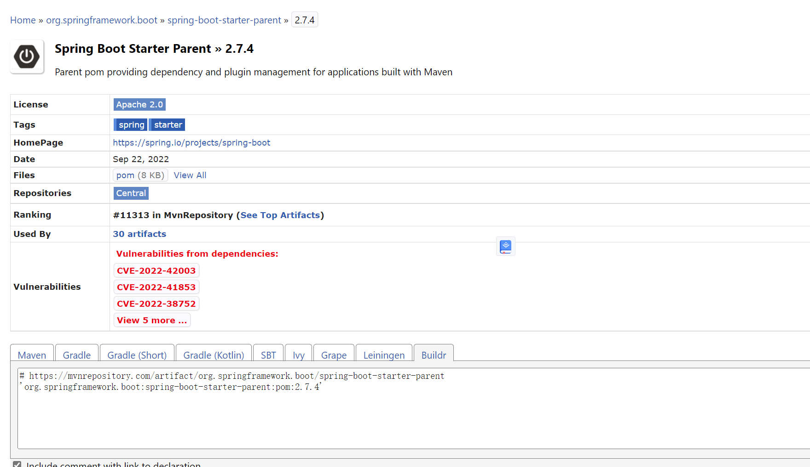
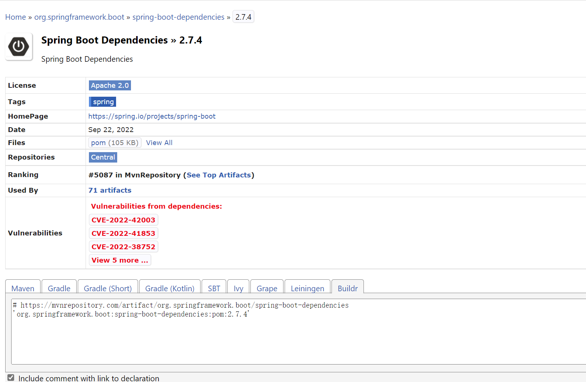

# Maven工程结构

## pom.xml文件分析

pom.xml文件包含了工程的各种信息， 通过分析可以知道Maven项目的关键概念：

- 父工程信息：SpringBoot之所以无需配置即可启动，实际上是在父工程中有相应默认配置。工程的解析和启动都依赖于父工程。
- 当前工程gav信息：当前工程特征信息。
- 通用属性设置：jdk版本属性等
- 依赖信息：依赖的三方jar信息
- 插件信息：编译时调用的maven插件内容，会在编译期对代码进行处理，如lombok会在编译期基于各种注解生成各类代码。

```xml
<?xml version="1.0" encoding="UTF-8"?>
<project xmlns="http://maven.apache.org/POM/4.0.0" xmlns:xsi="http://www.w3.org/2001/XMLSchema-instance"
         xsi:schemaLocation="http://maven.apache.org/POM/4.0.0 https://maven.apache.org/xsd/maven-4.0.0.xsd">
    <modelVersion>4.0.0</modelVersion>
    <!--父项目中配置了很多文件，所以SpringBoot无需配置多少东西就可以执行了-->
    <parent>
        <groupId>org.springframework.boot</groupId>
        <artifactId>spring-boot-starter-parent</artifactId>
        <version>2.7.4</version>
        <relativePath/> <!-- lookup parent from repository -->
    </parent>

    <!--当前项目的gav信息-->
    <groupId>com.example</groupId>
    <artifactId>NettyDemo</artifactId>
    <version>0.0.1-SNAPSHOT</version>
    <name>NettyDemo</name>
    <description>NettyDemo</description>

    <!--通用属性，java版本选择1.8-->
    <properties>
        <java.version>1.8</java.version>
    </properties>

    <!--依赖信息-->
    <dependencies>
        <!--springboot-web starter-->
        <dependency>
            <groupId>org.springframework.boot</groupId>
            <artifactId>spring-boot-starter-web</artifactId>
        </dependency>

        <!--springboot-test starter, 测试方法可在正常SpringBoot启动环境下执行case-->
        <dependency>
            <groupId>org.springframework.boot</groupId>
            <artifactId>spring-boot-starter-test</artifactId>
            <scope>test</scope>
        </dependency>
    </dependencies>

    <build>
        <plugins>
            <!--编译期会被执行的插件，比如Lombok会基于各种注解生成相应的java代码！-->
            <plugin>
                <groupId>org.springframework.boot</groupId>
                <artifactId>spring-boot-maven-plugin</artifactId>
                <configuration>
                    <excludes>
                        <exclude>
                            <groupId>org.projectlombok</groupId>
                            <artifactId>lombok</artifactId>
                        </exclude>
                    </excludes>
                </configuration>
            </plugin>
        </plugins>
    </build>

</project>
```

### 默认配置问题

直接父工程：spring-boot-starter-parent
maven仓库查看依赖信息：https://mvnrepository.com/artifact/org.springframework.boot/spring-boot-starter-parent/2.7.4
**注意**：实际上就是一个pom文件

**作用**：Parent pom providing dependency and plugin management for applications built with Maven。主要是配置插件和编译相关的内容

再看看祖父工程：spring-boot-dependencies
https://mvnrepository.com/artifact/org.springframework.boot/spring-boot-dependencies/2.7.4
**注意**：实际上就是一个pom文件

**作用**：Spring Boot Dependencies。主要是配置SpringBoot使用的依赖。

**注意**：SpringBoot一个具体版本实际上就是一系列配置和依赖（包括各个依赖的默认版本信息！）的组合，用户使用即指定父项目即会融合pom文件，然后得到最终的pom文件。


> > 父项目解决了第一个问题：为何SpringBoot无需配置即可使用？因为会融合父项目的pom文件，完成编译插件和依赖配置等内容的默认行为。


### 代码执行流程

SpringBoot应用启动会创建IOC容器，容器中已经创建好各种组件对象，并且各种配置也是以组件的形式存在于IOC容器中，SpringBoot web应用即运行在IOC容器环境上，可直接使用各种组件对象。

- 启动入口
  
  ```java
  @SpringBootApplication
  public class NettyDemoApplication {
  
    public static void main(String[] args) {
        SpringApplication.run(NettyDemoApplication.class, args);
    }
  }
  ```

跟进spring-boot:2.7.4包中的SpringApplication.java

- ApplicationContext构建

```java
public class SpringApplication {
    public SpringApplication(Class<?>... primarySources) {
        this((ResourceLoader)null, primarySources);
    }

    public static ConfigurableApplicationContext run(Class<?> primarySource, String... args) {
        return run(new Class[]{primarySource}, args);
    }

    public static ConfigurableApplicationContext run(Class<?>[] primarySources, String[] args) {
        return (new SpringApplication(primarySources)).run(args);
    }

    public ConfigurableApplicationContext run(String... args) {
        long startTime = System.nanoTime();
        DefaultBootstrapContext bootstrapContext = this.createBootstrapContext();
        ConfigurableApplicationContext context = null;
        this.configureHeadlessProperty();
        SpringApplicationRunListeners listeners = this.getRunListeners(args);
        listeners.starting(bootstrapContext, this.mainApplicationClass);

        try {
            ApplicationArguments applicationArguments = new DefaultApplicationArguments(args);
            ConfigurableEnvironment environment = this.prepareEnvironment(listeners, bootstrapContext, applicationArguments);
            this.configureIgnoreBeanInfo(environment);

            Banner printedBanner = this.printBanner(environment);
            // 创建的ApplicationContext，即IOC容器？但未被初始化，没有完成配置和组件存入容器操作
            context = this.createApplicationContext();
            context.setApplicationStartup(this.applicationStartup);
            // 完成IOC容器构建
            this.prepareContext(bootstrapContext, context, environment, listeners, applicationArguments, printedBanner);
            // 刷新IOC容器？
            this.refreshContext(context);
            // 刷新IOC容器完成？
            this.afterRefresh(context, applicationArguments);
            Duration timeTakenToStartup = Duration.ofNanos(System.nanoTime() - startTime);
            if (this.logStartupInfo) {
                (new StartupInfoLogger(this.mainApplicationClass)).logStarted(this.getApplicationLog(), timeTakenToStartup);
            }

            listeners.started(context, timeTakenToStartup);
            this.callRunners(context, applicationArguments);
        } catch (Throwable var12) {
            this.handleRunFailure(context, var12, listeners);
            throw new IllegalStateException(var12);
        }

        try {
            Duration timeTakenToReady = Duration.ofNanos(System.nanoTime() - startTime);
            listeners.ready(context, timeTakenToReady);
            return context;
        } catch (Throwable var11) {
            this.handleRunFailure(context, var11, (SpringApplicationRunListeners)null);
            throw new IllegalStateException(var11);
        }
    }

    // 创建ApplicationContext
    protected ConfigurableApplicationContext createApplicationContext() {
        return this.applicationContextFactory.create(this.webApplicationType);
    }
}
```

ApplicationContextFactory中

```java
@FunctionalInterface
public interface ApplicationContextFactory {
    ApplicationContextFactory DEFAULT = (webApplicationType) -> {
        try {
            Iterator var1 = SpringFactoriesLoader.loadFactories(ApplicationContextFactory.class, ApplicationContextFactory.class.getClassLoader()).iterator();

            ConfigurableApplicationContext context;
            do {
                if (!var1.hasNext()) {
                    return new AnnotationConfigApplicationContext();
                }

                ApplicationContextFactory candidate = (ApplicationContextFactory)var1.next();
                context = candidate.create(webApplicationType);
            } while(context == null);

            return context;
        } catch (Exception var4) {
            throw new IllegalStateException("Unable create a default ApplicationContext instance, you may need a custom ApplicationContextFactory", var4);
        }
    };

    ConfigurableApplicationContext create(WebApplicationType webApplicationType);

    static ApplicationContextFactory ofContextClass(Class<? extends ConfigurableApplicationContext> contextClass) {
        return of(() -> {
            return (ConfigurableApplicationContext)BeanUtils.instantiateClass(contextClass);
        });
    }

    static ApplicationContextFactory of(Supplier<ConfigurableApplicationContext> supplier) {
        return (webApplicationType) -> {
            return (ConfigurableApplicationContext)supplier.get();
        };
    }
}
```

两个实现类：AnnotationConfigReactiveWebServerApplicationContext和AnnotationConfigServletWebServerApplicationContext，分别对于Servlet和Reactive类型的Web应用。这边只看Servlet的。

```java
public class AnnotationConfigServletWebServerApplicationContext extends ServletWebServerApplicationContext implements AnnotationConfigRegistry {
    private final AnnotatedBeanDefinitionReader reader;
    private final ClassPathBeanDefinitionScanner scanner;
    private final Set<Class<?>> annotatedClasses;
    private String[] basePackages;

    public AnnotationConfigServletWebServerApplicationContext() {
        this.annotatedClasses = new LinkedHashSet();
        this.reader = new AnnotatedBeanDefinitionReader(this);
        this.scanner = new ClassPathBeanDefinitionScanner(this);
    }

    public AnnotationConfigServletWebServerApplicationContext(DefaultListableBeanFactory beanFactory) {
        super(beanFactory);
        this.annotatedClasses = new LinkedHashSet();
        this.reader = new AnnotatedBeanDefinitionReader(this);
        this.scanner = new ClassPathBeanDefinitionScanner(this);
    }

    public AnnotationConfigServletWebServerApplicationContext(Class<?>... annotatedClasses) {
        this();
        this.register(annotatedClasses);
        this.refresh();
    }

    public AnnotationConfigServletWebServerApplicationContext(String... basePackages) {
        this();
        this.scan(basePackages);
        this.refresh();
    }

    public void setEnvironment(ConfigurableEnvironment environment) {
        super.setEnvironment(environment);
        this.reader.setEnvironment(environment);
        this.scanner.setEnvironment(environment);
    }

    public void setBeanNameGenerator(BeanNameGenerator beanNameGenerator) {
        this.reader.setBeanNameGenerator(beanNameGenerator);
        this.scanner.setBeanNameGenerator(beanNameGenerator);
        this.getBeanFactory().registerSingleton("org.springframework.context.annotation.internalConfigurationBeanNameGenerator", beanNameGenerator);
    }

    public void setScopeMetadataResolver(ScopeMetadataResolver scopeMetadataResolver) {
        this.reader.setScopeMetadataResolver(scopeMetadataResolver);
        this.scanner.setScopeMetadataResolver(scopeMetadataResolver);
    }

    public final void register(Class<?>... annotatedClasses) {
        Assert.notEmpty(annotatedClasses, "At least one annotated class must be specified");
        this.annotatedClasses.addAll(Arrays.asList(annotatedClasses));
    }

    public final void scan(String... basePackages) {
        Assert.notEmpty(basePackages, "At least one base package must be specified");
        this.basePackages = basePackages;
    }

    protected void prepareRefresh() {
        this.scanner.clearCache();
        super.prepareRefresh();
    }

    protected void postProcessBeanFactory(ConfigurableListableBeanFactory beanFactory) {
        super.postProcessBeanFactory(beanFactory);
        if (this.basePackages != null && this.basePackages.length > 0) {
            this.scanner.scan(this.basePackages);
        }

        if (!this.annotatedClasses.isEmpty()) {
            this.reader.register(ClassUtils.toClassArray(this.annotatedClasses));
        }

    }

    static class Factory implements ApplicationContextFactory {
        Factory() {
        }

        public ConfigurableApplicationContext create(WebApplicationType webApplicationType) {
            return webApplicationType != WebApplicationType.SERVLET ? null : new AnnotationConfigServletWebServerApplicationContext();
        }
    }
}

```

注意：内部类调用外部构造函数，实现ApplicationContext的创建，内部持有了AnnotatedBeanDefinitionReader和ClassPathBeanDefinitionScanner对象，这俩对象在spring-context里面。

- ApplicationContext对象初始化

生成的ApplicationContext对象还未完成初始化，需要调用下面完成IOC容器初始化操作。

```java
    this.prepareContext(bootstrapContext, context, environment, listeners, applicationArguments, printedBanner);
    this.refreshContext(context);
    this.afterRefresh(context, applicationArguments);

    // ApplicationContext对象构建后，进行初始化环境操作
    private void prepareContext(DefaultBootstrapContext bootstrapContext, ConfigurableApplicationContext context, ConfigurableEnvironment environment, SpringApplicationRunListeners listeners, ApplicationArguments applicationArguments, Banner printedBanner) {
        context.setEnvironment(environment);
        this.postProcessApplicationContext(context);
        this.applyInitializers(context);
        listeners.contextPrepared(context);
        bootstrapContext.close(context);
        if (this.logStartupInfo) {
            this.logStartupInfo(context.getParent() == null);
            this.logStartupProfileInfo(context);
        }

        ConfigurableListableBeanFactory beanFactory = context.getBeanFactory();
        beanFactory.registerSingleton("springApplicationArguments", applicationArguments);
        if (printedBanner != null) {
            beanFactory.registerSingleton("springBootBanner", printedBanner);
        }

        if (beanFactory instanceof AbstractAutowireCapableBeanFactory) {
            ((AbstractAutowireCapableBeanFactory)beanFactory).setAllowCircularReferences(this.allowCircularReferences);
            if (beanFactory instanceof DefaultListableBeanFactory) {
                ((DefaultListableBeanFactory)beanFactory).setAllowBeanDefinitionOverriding(this.allowBeanDefinitionOverriding);
            }
        }

        if (this.lazyInitialization) {
            context.addBeanFactoryPostProcessor(new LazyInitializationBeanFactoryPostProcessor());
        }

        context.addBeanFactoryPostProcessor(new PropertySourceOrderingBeanFactoryPostProcessor(context));
        Set<Object> sources = this.getAllSources();
        Assert.notEmpty(sources, "Sources must not be empty");
        this.load(context, sources.toArray(new Object[0]));
        listeners.contextLoaded(context);
    }

    // ApplicationContext对象初始化环境完成后？
    private void refreshContext(ConfigurableApplicationContext context) {
        if (this.registerShutdownHook) {
            shutdownHook.registerApplicationContext(context);
        }
        this.refresh(context);
    }
    protected void refresh(ConfigurableApplicationContext applicationContext) {
        applicationContext.refresh();
    }
    
    // ApplicationContext对象初始化环境完成后？
    protected void afterRefresh(ConfigurableApplicationContext context, ApplicationArguments args) {
    }
```
